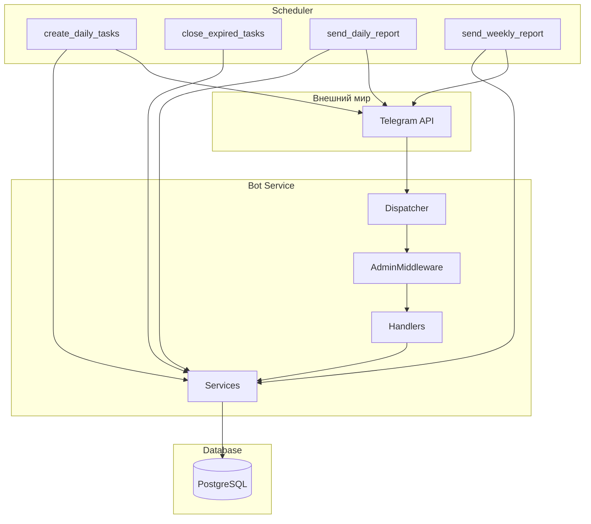

# Critical Project Review — Критика проекта

## Введение

Документ содержит критический обзор проекта «Детский контроллер» с позиций **архитектора** и **бизнес-аналитика**: доработки ПО структурированы по приоритету, отдельно выделены риски и неопределённости в бизнес-процессах. Прежние замечания перепроверены: отмечено, что является реальной ошибкой/риском, а что — намеренным решением или вкусовой рекомендацией. В конце приведены **вопросы к заказчику/продукту**, ответы на которые нужны для приоритизации и однозначной доработки.

**Код по этому документу не меняется** — фиксируются только выводы и рекомендации.

---

## Как читать документ

| Раздел | Содержание |
|--------|------------|
| **Проверка на противоречия** | Логика и архитектура, соответствие ревью текущей реализации, уточнения |
| **Часть A** | Доработки программного обеспечения (критично / желательно / по возможности) |
| **Часть B** | Бизнес-процессы: что зафиксировано, где есть неопределённости и риски |
| **Верификация** | Подтверждение или уточнение прежних замечаний ревью |
| **Вопросы к заказчику** | Опрос для прояснения требований и приоритетов |
| **Итоговый список** | Сводный приоритизированный список доработок |
| **Ответы заказчика** | Принятые решения и приоритеты |

**Решения заказчика:** Все пункты Части A приняты к исполнению.

---

# Проверка на противоречия и соответствие текущей реализации

Раздел добавлен после сверки документа с кодовой базой: проверены противоречия в логике, в архитектуре и соответствие утверждений ревью текущей реализации.

## Противоречия в логике

**Не выявлено.** Рекомендации между собой не конфликтуют.

- Очередь A → B → C: сначала проверка «только назначенный ребёнок» (A), затем рефакторинг на сервисы (B). Проверку можно добавить в handler до или после перехода на сервисы; при рефакторинге (B) проверку оставить в handler (после получения задачи) или перенести в сервис — оба варианта согласованы.
- П.2 (миграции) и п.8 (удаление Chat): при удалении модели Chat необходимо создать и применить миграцию на удаление таблицы `chats` (если она создавалась через `create_all`). П.2 задаёт правило «все изменения схемы — через миграции», п.8 выполняется в рамках этого правила.

## Противоречия в архитектуре

**Не выявлено.**

- Использование сервисов (п.3, п.4) и единая точка подключения AdminMiddleware (п.6) не конфликтуют: middleware можно вынести в общий роутер или подключать при регистрации админ-роутеров в `main.py`.
- Рекомендация «общий форматтер отчёта по ребёнку» (п.5) согласована с текущим UX (отдельное сообщение по ребёнку) и не требует менять поведение для пользователя.

## Соответствие утверждений ревью текущей реализации

| Утверждение в ревью | Статус |
|---------------------|--------|
| В `children.py` нет проверки `from_user.id` vs `task.child.telegram_user_id` | **Верно** — проверки нет. |
| При старте вызывается `init_db()` (create_all), на деплое — alembic upgrade | **Верно** — в `main.py` lifespan вызывается `await init_db()`; в `server-update.sh` — `alembic upgrade head`. |
| В alembic/versions нет миграции для таблицы `chats` | **Верно** — есть только 001, 002, 003; таблица `chats` не создаётся миграциями. |
| В `children.py` поиск задачи и сохранение медиа вручную, сервисы не используются | **Верно** — прямые select/update/add, TaskService и MediaService не импортируются. |
| В `handle_assign_task_do` дублируется логика TaskService.create_task_for_child (проверка дубликата, reward, создание Task) | **Верно** — проверка existing, выборка ChildTaskReward/TaskType.reward_amount, создание Task совпадают по смыслу. В handler при создании не передаются chat_id/message_id (проставляются после отправки сообщения); при переходе на сервис достаточно вызвать create_task_for_child с message_id=0 и затем обновить task.message_id и task.chat_id. |
| В admin_menu текст отчёта за день собирается вручную; format_daily_report_text возвращает один текст на весь день | **Верно** — в handle_report_total циклы по child_data/task_info; в ReportService.format_daily_report_text — один return "\n".join(lines) по всем детям. |
| WEEKDAYS_RU и get_week_days_string есть в admin_menu и report_service | **Верно** — в обоих файлах объявлены одинаковые константа и функция. |
| AdminMiddleware подключён в каждом админ-модуле отдельно | **Верно** — в admin_children, admin_access, admin_task_types, admin, admin_menu. |
| Модель Chat не используется (нет создания/чтения записей) | **Верно** — в коде нет обращений к таблице chats / классу Chat. |
| get_db() нигде не вызывается | **Верно** — везде используется AsyncSessionLocal(). |
| Роутер children зарегистрирован раньше admin_menu | **Верно** — в main.py порядок именно такой; комментарий о важности порядка уже есть (строки 103–104). |
| В ScheduleService фильтр по days_of_week в Python (перебор) | **Верно** — цикл for schedule in schedules с проверкой weekday_name in schedule.days_of_week. |

## Уточнения и дополнения

1. **П.10 (порядок роутеров):** В `main.py` уже есть комментарий: «Роутер children должен быть зарегистрирован раньше admin_menu, чтобы обработчик task_complete не перехватывался». Доработка п.10 может ограничиться упоминанием этого в архитектурном описании или оставлением комментария как есть.

2. **П.8 (удаление Chat) и п.2 (миграции):** При выполнении п.8 нужно создать миграцию, которая удаляет таблицу `chats` (DROP TABLE IF EXISTS chats или аналог), так как на проде схема ведётся миграциями, а не create_all. Иначе после удаления модели из кода таблица на проде останется.

3. **П.8 (решение по Chat):** В разделе A.3 п.8 зафиксировано решение заказчика: модель Chat удалить (канал/чат пока не нужен). Вариант «зарезервировать под будущее» снят.

---

# Часть A. Доработки программного обеспечения

## A.1. Критично (безопасность и корректность)

### 1. Проверка «только назначенный ребёнок может выполнить задание»

**Суть:** При нажатии «Выполнил» и при приёме медиа не проверяется, что `from_user.id` совпадает с `task.child.telegram_user_id`. Любой, у кого есть сообщение (в т.ч. пересланное), может отметить задание выполненным.

**Верификация:** Подтверждено. В `children.py` такой проверки нет.

**Рекомендация:** Добавить проверку и при несовпадении отвечать: «Это задание назначено другому пользователю.» Критичность зависит от сценария: если задания уходят только в личку и пересылка маловероятна, риск ниже, но с точки зрения корректности проверка желательна.

---

### 2. Схема БД: init_db и миграции

**Суть:** При старте вызывается `create_all` (init_db), на деплое — `alembic upgrade head`. Добавление полей/моделей без миграции ведёт к расхождению схемы между окружениями.

**Верификация:** Подтверждено. В alembic/versions нет миграции для таблицы `chats`; модель Chat есть в коде. Таблица может создаваться только через create_all.

**Рекомендация:** При любом изменении моделей создавать и применять миграцию. На проде опираться на миграции, а не на create_all.

---

## A.2. Желательно (архитектура и поддержка)

### 3. Использование сервисов в handlers

**Суть:** TaskService и MediaService существуют, но в `children.py` поиск задачи, обновление статуса и сохранение медиа делаются вручную. Дублируется логика.

**Верификация:** Подтверждено. Нюанс: TaskService.get_task_by_message не фильтрует по статусу PENDING — при переходе на сервис нужно либо проверять статус в handler, либо ввести get_pending_task_by_message.

**Рекомендация:** Вызывать из handlers TaskService (get_task_by_message / mark_task_as_done) и MediaService (save_task_media), чтобы логика была в одном месте и её проще тестировать.

---

### 4. Ручное назначение задания и TaskService

**Суть:** В `admin_task_types.py` (handle_assign_task_do) логика создания задачи (дубликат на сегодня, reward из ChildTaskReward/TaskType, создание Task) совпадает с TaskService.create_task_for_child.

**Верификация:** Подтверждено. Дублирование однозначное.

**Рекомендация:** В handler вызывать TaskService.create_task_for_child; отправку сообщения ребёнку и запись message_id оставить в handler.

---

### 5. Форматирование отчётов в админ-меню

**Суть:** В admin_menu текст отчёта за день собирается вручную по child_data/task_info. В ReportService есть format_daily_report_text.

**Верификация:** Уточнение. format_daily_report_text возвращает **один** текст на весь день (все дети подряд). В админке сейчас отправляется **отдельное сообщение по каждому ребёнку** — это может быть намеренно (удобнее в Telegram). Ошибкой это не является; дублирование есть в **формате строк** (emoji, время, сумма). Использование format_daily_report_text «как есть» изменило бы поведение (одно длинное сообщение вместо нескольких).

**Рекомендация:** Либо вынести общий форматтер одного «блока по ребёнку» (одна функция/метод) и использовать в ReportService и в admin_menu; либо добавить в ReportService метод вида format_daily_report_text_per_child и вызывать его из admin_menu. Так сохранится текущий UX и уйдёт дублирование формата.

---

### 6. AdminMiddleware в одном месте

**Суть:** Middleware подключён в каждом админ-модуле отдельно. При новом админ-файле легко забыть проверку прав.

**Верификация:** Подтверждено. Риск человеческой ошибки при расширении.

**Рекомендация:** Подключать AdminMiddleware один раз к группе админ-роутеров (общий router или при регистрации в main.py).

---

### 7. Общие константы WEEKDAYS_RU и get_week_days_string

**Суть:** Одинаковые константа и функция в admin_menu и report_service.

**Верификация:** Подтверждено. Чисто дублирование, не ошибка.

**Рекомендация:** Вынести в общий модуль (например, bot/utils/formatting.py) или оставить в report_service и импортировать в admin_menu.

---

## A.3. По возможности (чистота кода и оптимизация)

### 8. Неиспользуемые сущности: Chat, get_db

**Chat:** Модель есть, таблица в коде не используется (нет создания/чтения записей). В SPEC указано, что family_group устарел. Миграций под chats в alembic/versions нет — таблица может появляться только через create_all.

**get_db:** Генератор объявлен в db/database.py, нигде не вызывается; везде используется AsyncSessionLocal().

**Верификация:** Подтверждено. Это не ошибка работы системы, а технический долг.

**Решение заказчика:** Модель Chat удалить (канал/чат пока не нужен). **Рекомендация:** При удалении Chat (очередь C) обязательно создать и применить миграцию на удаление таблицы `chats` (DROP TABLE), чтобы схема на проде соответствовала коду (см. п.2). По get_db — либо начать использовать при переходе на DI, либо удалить.

---

### 9. Документация по AutoDeleteMiddleware и schedule_message_delete

**Суть:** Похожие названия, разное назначение: middleware удаляет сообщения **пользователя** через 60 сек; утилита — отложенное удаление **конкретного сообщения** (часто бота) по таймауту.

**Верификация:** Подтверждено. Путаница возможна при поддержке.

**Рекомендация:** Явно описать в docstring или в обзоре архитектуры различие между «удаление сообщений пользователя» и «удаление ответов бота по таймеру».

---

### 10. Порядок роутеров в main.py

**Суть:** Роутер children должен быть зарегистрирован раньше admin_menu, иначе callback task_complete может обрабатываться не там.

**Верификация:** Подтверждено. Это не ошибка, а требование к порядку. В текущей реализации порядок соблюдён, в main.py уже есть комментарий (строки 103–104) о необходимости регистрировать children раньше admin_menu.

**Рекомендация:** Сохранять этот комментарий при изменениях main.py; при наличии архитектурного описания — продублировать требование там.

---

### 11. Фильтр по дням недели в ScheduleService

**Суть:** Фильтр по days_of_week выполняется в Python (перебор расписаний). При большом числе расписаний можно перенести в SQL.

**Верификация:** Подтверждено. Сейчас объём данных небольшой, это не баг.

**Рекомендация:** Оптимизация по мере необходимости; приоритет низкий.

---

# Часть B. Бизнес-процессы и неопределённости

## B.1. Основные потоки (как задумано по SPEC)

- **Назначение заданий:** по расписанию (scheduler) или вручную (админ). Задание создаётся в БД, ребёнку уходит сообщение в личку с кнопкой «Выполнил».
- **Выполнение:** ребёнок нажимает «Выполнил»; при requires_media — присылает фото/видео ответом на сообщение. Статус задачи → done, админу уходит уведомление.
- **Закрытие дня:** ночной job переводит невыполненные задачи в failed/expired.
- **Отчёты:** ежедневный и еженедельный по расписанию; плюс ручные отчёты из админки (сегодня / вчера / неделя).

## B.2. Где поведение неоднозначно или не зафиксировано

1. **Уведомление админу при выполнении задания.** Сейчас при любом выполнении админ получает сообщение: при `notify_on_completion = true` — «Ребёнок X выполнил задание «Y» только что»; при `false` — «Задание выполнено! Ребенок, Задание, Награда». То есть при `false` уведомление не отключается, меняется только текст. В SPEC явно не сказано: при `notify_on_completion = false` админ вообще не должен получать уведомление или должен получать в сокращённом виде? Требуется уточнение с бизнесом.

2. **Кто может нажать «Выполнил».** SPEC не формулирует явно: «только назначенный ребёнок». Сейчас может нажать любой, у кого есть сообщение. Нужно зафиксировать: это допустимо (например, только личка, пересылка не сценарий) или требуется проверка по telegram_user_id.

3. **Отчёт «за неделю» в админке vs по расписанию.** В админке «неделя» — последние 7 дней (скользящее окно). Еженедельный job по SPEC — отчёт за конкретную неделю (пн–вс). Разные форматы; нужно ли их унифицировать и как именно — вопрос к продукту.

4. **Роль «админ».** Сейчас любой пользователь с role=ADMIN получает полный доступ к панели. Ограничение только для «первичного» админа (ADMIN_TELEGRAM_ID) — его нельзя удалить. **Ответ заказчика:** оба родителя могут быть админом; только две роли — родители как админ, дети как юзер (текущая модель сохраняется).

5. **Таблица chats и канал отчётов.** **Решение заказчика:** убрать, пока не нужно. Модель Chat и функционал канала отчётов не планируются к использованию; модель Chat подлежит удалению (очередь C).

---

# Верификация прежних замечаний ревью

| Замечание | Статус | Комментарий |
|-----------|--------|-------------|
| Дублирование логики в children.py и сервисах | **Подтверждено** | Рекомендация использовать сервисы остаётся; при переходе учесть фильтр PENDING. |
| Дублирование в handle_assign_task_do и TaskService | **Подтверждено** | Однозначное дублирование. |
| Использование format_daily_report_text в админке | **Уточнено** | Текущий UX — отдельное сообщение по ребёнку; format_daily_report_text даёт один блок на день. Рекомендация — общий форматтер блока по ребёнку или отдельный метод в ReportService. |
| WEEKDAYS_RU / get_week_days_string в двух местах | **Подтверждено** | Дублирование. |
| Проверка «только назначенный ребёнок» | **Подтверждено** | Проверки нет; критичность зависит от сценария использования. |
| notify_on_completion и уведомление админу | **Подтверждено** | При false админ всё равно получает сообщение (другой текст). Нужно уточнить у бизнеса желаемое поведение. |
| AdminMiddleware в каждом модуле | **Подтверждено** | Риск забыть при новом модуле. |
| AutoDeleteMiddleware vs schedule_message_delete | **Подтверждено** | Разное назначение; стоит явно описать. |
| Модель Chat не используется | **Подтверждено** | Решение заказчика: удалить (очередь C); при удалении — миграция на DROP TABLE chats. |
| get_db не используется | **Подтверждено** | Техдолг. |
| init_db и Alembic вместе | **Подтверждено** | Риск расхождения схемы. |
| Порядок роутеров | **Подтверждено** | Требование к порядку; зафиксировать. |
| handle_access в admin_menu вызывает admin_access | **Факт, не ошибка** | Две точки входа; при изменении раздела «Доступы» помнить о двух местах. |

---

# Вопросы к заказчику / продукту (опрос)

Ответы помогут приоритизировать доработки и зафиксировать требования.

1. **Выполнение задания только назначенным ребёнком.** Должна ли система проверять, что «Выполнил» и медиа отправил именно тот пользователь, которому назначено задание (по Telegram ID)? Или допустимо, что задание может отметить кто угодно, у кого есть сообщение (например, пересланное)?

2. **Уведомление админу при notify_on_completion = false.** Сейчас при любом выполнении админ получает сообщение; при выключенном «уведомлять при выполнении» — в сокращённом формате. Нужна ли опция «вообще не уведомлять админа при выполнении этого типа задания»?

3. **Отчёт «за неделю» в админке.** Сейчас в боте «неделя» — последние 7 дней (по дням). По расписанию еженедельный отчёт — за календарную неделю (пн–вс). Нужно ли привести форматы к одному виду и какому (7 дней / календарная неделя)?

4. **Несколько админов.** Планируется ли несколько родителей/админов с полным доступом к одному и тому же боту? Нужны ли разные роли (например, «только просмотр» vs «полное управление») или текущей модели «все админы равны» достаточно?

5. **Приоритет доработок.** Что важнее в первую очередь: (A) проверка «только назначенный ребёнок», (B) рефакторинг на единое использование сервисов в handlers, (C) упорядочивание миграций и неиспользуемого кода (Chat, get_db), (D) другое (напишите)?

---

# Ответы заказчика

- **П.4 (несколько админов):** Оба родителя могут быть админом. Только две роли: родители как админ, дети — юзер (текущая модель «все админы равны» сохраняется).
- **Канал/чат для отчётов:** Убрать. Пока не нужен (модель Chat и функционал канала не планируются к использованию).
- **П.5 (приоритет доработок):** A, B, C — в таком порядке: сначала (A) проверка «только назначенный ребёнок», затем (B) рефакторинг сервисов в handlers, затем (C) упорядочивание миграций и неиспользуемого кода.

---

# Итоговый структурированный список доработок

**Все пункты Части A приняты.** Порядок выполнения по решению заказчика: **A → B → C**.

## Порядок выполнения (A → B → C)

| Очередь | Пункты | Содержание |
|---------|--------|------------|
| **A** | 1, 2 | Проверка «только назначенный ребёнок»; миграции и схема БД |
| **B** | 3, 4, 5, 6, 7 | Рефакторинг: сервисы в children.py и handle_assign_task_do; форматтер отчётов; AdminMiddleware в одном месте; WEEKDAYS_RU/get_week_days_string в общий модуль |
| **C** | 8, 9, 10, 11 | Удалить модель Chat и создать миграцию на удаление таблицы chats; решить судьбу get_db; документация по auto_delete; комментарий в main.py (или сохранить существующий); оптимизация ScheduleService (низкий приоритет) |

## По программному обеспечению

| № | Доработка | Очередь |
|---|-----------|---------|
| 1 | Проверка «только назначенный ребёнок» при выполнении задания | A |
| 2 | Создание и применение миграций при изменении моделей; не полагаться на create_all на проде | A |
| 3 | Вызов TaskService/MediaService из children.py вместо ручной логики | B |
| 4 | Вызов TaskService.create_task_for_child в handle_assign_task_do | B |
| 5 | Общий форматтер блока отчёта по ребёнку или метод в ReportService; использование в admin_menu | B |
| 6 | AdminMiddleware подключать один раз к группе админ-роутеров | B |
| 7 | Вынести WEEKDAYS_RU и get_week_days_string в общий модуль | B |
| 8 | Удалить модель Chat (канал/чат пока не нужен); создать миграцию на DROP TABLE chats. get_db — удалить или зарезервировать с комментарием | C |
| 9 | Docstring/документация: различие AutoDeleteMiddleware и schedule_message_delete | C |
| 10 | Сохранить или продублировать в архитектуре комментарий в main.py про порядок регистрации роутеров (уже есть) | C |
| 11 | Фильтр по дням недели в ScheduleService в SQL (при росте нагрузки) | C (низкий) |

## По бизнес-процессам

| № | Действие | Примечание |
|---|----------|------------|
| 1 | Зафиксировать в SPEC или в коде: при notify_on_completion = false админ получает сокращённое уведомление (или не получает — по ответу на опрос) | Вопрос 2 пока без ответа |
| 2 | Зафиксировать в SPEC: кто может нажимать «Выполнил» (только ребёнок или любой) | Вопрос 1 пока без ответа; реализация проверки — в очереди A |
| 3 | Привести форматы отчёта «неделя» в админке и по расписанию к единому виду | Вопрос 3 пока без ответа |

---

# Глубокая аналитика архитектуры

Раздел описывает текущую архитектуру проекта, потоки данных и баланс сильных/слабых сторон.

## Структура проекта

- **Монолитная архитектура:** bot, db, scheduler работают в одном процессе
- **Слои:** handlers → services → models (слой репозиториев отсутствует)
- **Middleware:** AdminMiddleware подключён единоразово к admin_router в main.py
- **FSM:** состояния определены в bot/handlers/fsm_states.py

## Потоки данных

| Поток | Цепочка |
|-------|---------|
| Создание задач | scheduler (jobs.py) → ScheduleService → TaskService → БД; отправка через bot_instance |
| Выполнение | children.py → TaskService/MediaService → БД; проверка telegram_user_id |
| Отчёты | ReportService.format_daily_report_block_one_child используется в admin_menu |

## Сильные стороны

- Чёткое разделение handlers / services / models
- TaskService используется в handle_assign_task_do и children.py; проверка «только назначенный ребёнок» реализована
- AdminMiddleware централизован (admin_router в main.py)
- bot/utils/formatting.py — общий модуль для WEEKDAYS_RU, get_week_days_string

## Слабые стороны

- В handle_assign_task_do создаётся новый экземпляр Bot вместо использования callback.bot
- Дублирование DAYS_OF_WEEK в admin_task_types.py (локально) vs WEEKDAYS_RU в formatting.py
- Нет dependency injection — AsyncSessionLocal() вызывается напрямую
- init_db (create_all) + Alembic — риск расхождения схемы (отмечено в Части A)

---

# Логика проекта

Ключевые сценарии и неоднозначности в поведении системы.

## Ключевые сценарии

| Сценарий | Описание |
|----------|----------|
| Расписание | Каждые 5 минут проверка time_of_day и days_of_week; фильтр по дням в Python (ScheduleService) |
| Выполнение | callback TASK_COMPLETE → get_pending_task_by_message → проверка telegram_user_id → mark_task_as_done / MediaService |
| notify_on_completion | При true — короткое уведомление админу; при false — развёрнутое (противоречие с интуицией названия) |
| Закрытие дня | 23:59, вчерашние pending → failed |

## Неоднозначности

- **«Неделя» в админке:** последние 7 дней (скользящее окно); по расписанию — календарная неделя (пн–вс). Форматы различаются.

---

# Этапы развития проекта

Предлагаемая последовательность развития проекта.

## Этап 1 — Стабилизация (приоритет A)

- Доработки из текущего ревью: миграции, Chat/get_db (если не выполнено)
- Уточнение notify_on_completion: при false — не уведомлять или оставить как есть

## Этап 2 — Качество кода

- Использовать callback.bot вместо создания нового Bot в handle_assign_task_do
- Унифицировать DAYS_OF_WEEK → импорт из formatting или общий справочник
- Добавить типизацию и docstring для публичных методов сервисов

## Этап 3 — Расширение функционала (варианты)

- Экспорт отчётов в CSV/Excel
- Мультиязычность (i18n)
- Уведомления в канал/чат (модель Chat, если потребуется)
- Ручная модерация медиа (is_reviewed в tasks)
- Гибкие периоды отчётов (выбор дат)
- Интеграция с Duolingo API (автопроверка выполнения)

## Этап 4 — Масштабирование

- Webhook вместо polling при высокой нагрузке
- Вынести scheduler в отдельный worker (Celery/RQ) при росте объёма
- Кэширование (Redis) для частых запросов (списки детей, типы заданий)

---

# Варианты развития — вопросы и опции

Вопросы для принятия решений по направлению развития.

## Вопрос 1: Multi-tenant

Нужна ли поддержка нескольких семей/организаций?

| Вариант | Описание |
|---------|----------|
| A | Один бот — одна семья (текущая модель) |
| B | Несколько семей в одном инстансе (family_id / organization_id) |

## Вопрос 2: Веб-админка

| Вариант | Описание |
|---------|----------|
| Текущая модель | Только Telegram |
| Расширение | Дополнительный web-интерфейс для отчётов и настроек |

## Вопрос 3: Экспорт данных

| Вариант | Приоритет |
|---------|-----------|
| CSV/Excel для отчётов | Средний |
| Резервное копирование БД | Высокий |

## Вопрос 4: Push-напоминания

| Вариант | Описание |
|---------|----------|
| Сейчас | Только задание в момент по расписанию |
| Расширение | «Остался 1 час» и т.п. до дедлайна |

---

# Сводная диаграмма архитектуры

---

*Документ обновлён после повторного анализа с позиций архитектора и бизнес-аналитика. Код проекта не изменялся.*
